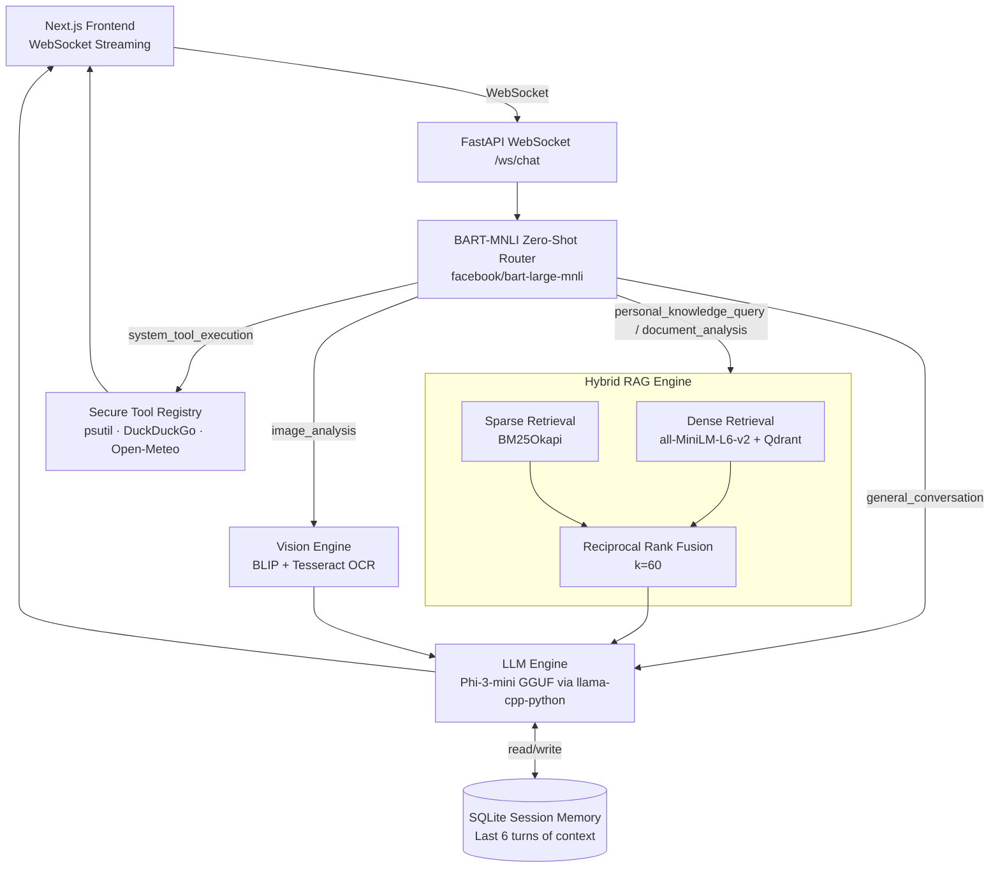

# Axon — Production Multimodal AI Assistant

A locally-hosted AI assistant with hybrid RAG, semantic routing, multimodal input, and zero external LLM API dependencies.

## Architecture



## Models Used

| Model | Role | Size | Why |
|---|---|---|---|
| all-MiniLM-L6-v2 | Text Embeddings | ~90MB | Fast, 384-dim, strong semantic similarity at small size |
| facebook/bart-large-mnli | Semantic Router | ~1.6GB | Zero-shot NLI classification — no fine-tuning required |
| Phi-3-mini-4k-instruct Q4_K_M | LLM (generation) | ~2.3GB | State-of-the-art at its size class, runs efficiently on CPU via llama.cpp |
| Salesforce/blip-image-captioning-base | Vision | ~990MB | Strong image captioning + composable with Tesseract OCR |

## Design Decisions

**llama-cpp-python over Ollama:** Ollama is a daemon that wraps GGUF models over HTTP. Using llama-cpp-python directly loads the model into the Python process — no daemon dependency, reproducible, and embeds cleanly in Docker.

**BART MNLI over prompt-based routing:** A prompt-based router (asking the LLM "which category is this?") adds a full LLM inference round-trip to every request. BART-MNLI runs a dedicated classification head on ~50ms CPU inference with calibrated confidence scores.

**Reciprocal Rank Fusion over naive concatenation:** Pure dense retrieval misses exact keyword matches. Pure BM25 misses semantic similarity. RRF merges ranked lists from both without requiring score normalisation across incompatible scales.

**BM25 in-memory index:** The BM25 corpus is rebuilt on each ingest and held in RAM. For the scale this project operates at (hundreds to low thousands of chunks), this is faster than a database round-trip and avoids an additional service dependency.

## Quick Start

```bash
# 1. Clone and enter the project
git clone <repo_url> && cd axon-core

# 2. Download all model weights (~5GB total)
chmod +x scripts/download_models.sh
./scripts/download_models.sh

# 3. Start backend + Qdrant
docker compose up -d

# 4. Start frontend
cd axon-ui && npm install && npm run dev
```

Open http://localhost:3000

## Ingesting Your Documents

Upload files via the UI (drag-and-drop button in the header), or call the API directly:

```bash
curl -X POST http://localhost:8000/ingest -F "file=@yourfile.pdf"
```

Supported: `.pdf`, `.txt`, `.png`, `.jpg`
