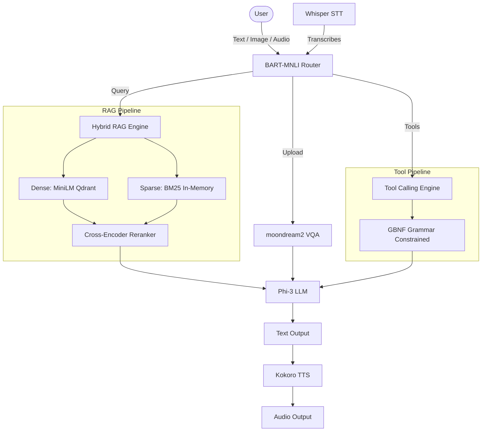

# Axon - Self-Hosted Multimodal AI Assistant

Tri-modal AI assistant (text, speech, vision) with hybrid RAG, cross-encoder reranking, and a BART-MNLI semantic router. Zero external LLM API dependencies.

## Architecture



## Model Roster

| Model | Role | Size | Source |
|-------|------|------|--------|
| all-MiniLM-L6-v2 | Sentence Embeddings | ~90MB | HF: sentence-transformers |
| facebook/bart-large-mnli | Semantic Router | ~1.6GB | HF: facebook |
| cross-encoder/ms-marco-MiniLM-L-6-v2 | Reranker | ~90MB | HF: cross-encoder |
| Phi-3-mini-4k-instruct Q4_K_M | LLM Generation | ~2.3GB | HF: microsoft |
| vikhyatk/moondream2 | Visual QA | ~1.9GB | HF: vikhyatk |
| openai/whisper-tiny.en | Speech-to-Text | ~150MB | HF: openai |
| hexgrad/Kokoro-82M | Text-to-Speech | ~82MB | HF: hexgrad |

Total: ~6.3GB

## Design Decisions

**Cross-Encoder over pure bi-encoder retrieval:** Bi-encoders (like MiniLM) encode query and document independently, so they can't model query-document interaction. Cross-encoders see both together — they rerank the top-N bi-encoder candidates with significantly higher precision at acceptable latency.

**Grammar-constrained tool calling over free-form JSON parsing:** llama-cpp-python supports GBNF grammar sampling, which constrains the token distribution to only produce valid JSON with the correct tool name. Eliminates JSON parsing failures and tool name hallucination.

**moondream2 over BLIP-base:** BLIP-base performs unconditional captioning — it describes an image without considering the user's question. moondream2 supports prompted VQA, enabling the system to answer specific visual questions. At 1.9GB it's viable on CPU for batch (non-real-time) inference.

**Token-aware chunking:** Document ingestion relies strictly on token-aware boundaries (rather than standard word splitting) to guarantee safety under the strict 512-token dense limits.

## Quick Start

1. Install backend and frontend dependencies:

   ```bash
   pip install -r requirements.txt
   cd axon-ui && npm install
   ```

2. Download ~6.3GB of local models:

   ```bash
   bash scripts/download_models.sh
   ```

3. Boot up the local Qdrant Vector database:

   ```bash
   docker-compose up -d qdrant
   ```

4. Launch Axon backend and frontend:

   ```bash
   uvicorn app.main:app --reload
   # In another terminal:
   cd axon-ui && npm run dev
   ```

## Engineering Notes

- Fully local inference stack with zero external LLM API dependencies
- Modular service-oriented backend architecture
- Hybrid retrieval pipeline with dense + sparse search fusion
- Cross-encoder reranking for improved retrieval precision
- Grammar-constrained tool calling using GBNF sampling
- Token-aware document chunking for dense embedding safety
- Optimized for consumer-grade hardware deployment
- No dead dependencies and unused abstraction layers
