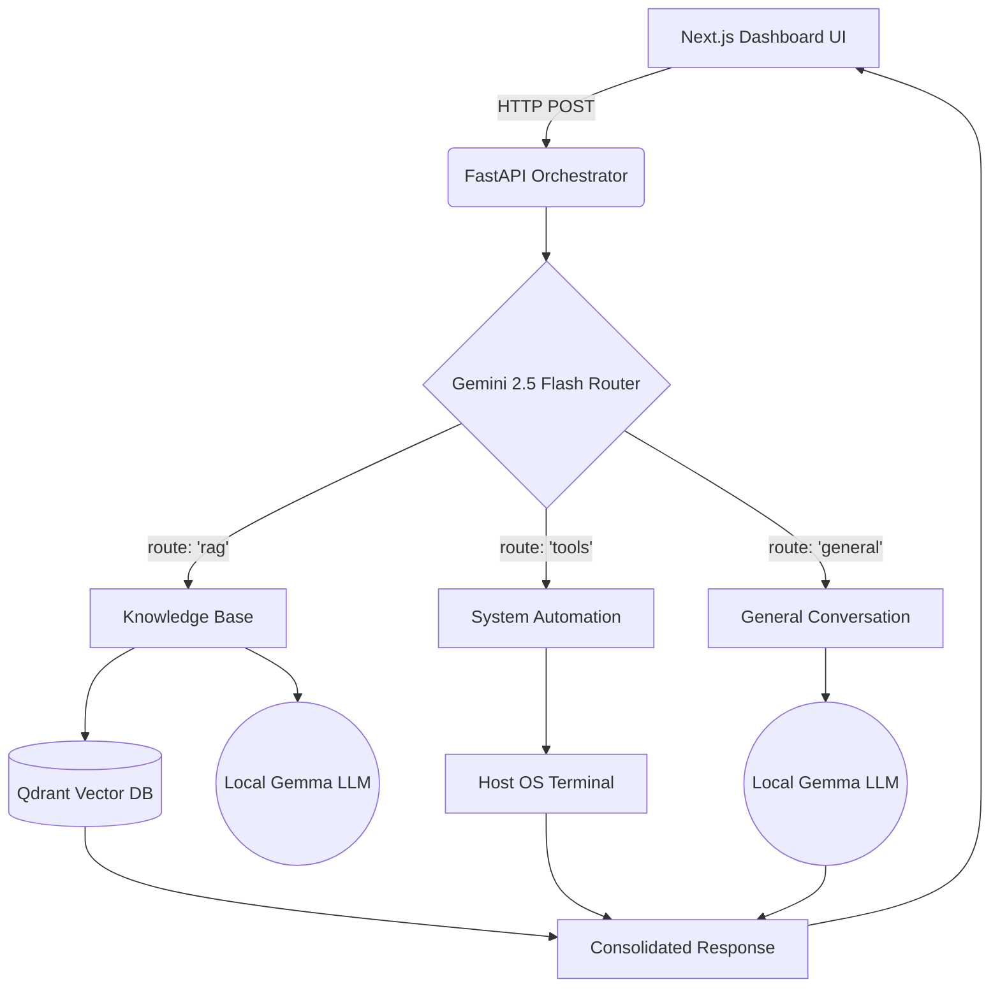

# Axon Core

Axon Core is a "Tri-Modal" AI assistant designed to act as a highly personalized, locally-hosted intelligence engine. It combines a Next.js frontend dashboard with a high-performance FastAPI orchestrator, utilizing a hybrid architecture that seamlessly routes user intent between personal knowledge retrieval, operating system automation, and general conversational AI.

##System Architecture

Axon Core utilizes a "Semantic Router" pattern to determine the optimal execution path for every user query. 



### The Three Routing Lanes:

1. **Knowledge Base (RAG):** Activated for personal queries (e.g., "What is my roll number?"). Pulls embedded data from a local Qdrant Vector DB and generates answers using `gemma:latest`.
2. **System Tools:** Activated for OS-level tasks. Safely executes system commands (e.g., `uname -a`, directory listings) and returns the terminal output.
3. **General AI:** Activated for standard chat, logic, and coding assistance, bypassing the vector database for faster inference.

## Tech Stack

**Frontend (The Glass):**
* Framework: Next.js (React)
* Styling: Tailwind CSS
* Icons: Lucide React

**Backend (The Engine):**
* Framework: FastAPI (Python)
* Orchestration: LangChain
* Routing: Google Gemini 2.5 Flash API
* Local LLM: Ollama (Running `gemma:latest`)
* Embeddings: `nomic-embed-text`
* Vector Database: Qdrant
* Containerization: Docker & Docker Compose

## Project Structure

```text
axon-core/
├── axon-ui/                 # Next.js Frontend Dashboard
│   ├── src/app/page.tsx     # Main chat interface
│   └── package.json         
├── app/                     # FastAPI Backend
│   ├── main.py              # API Orchestrator & CORS config
│   ├── rag/
│   │   └── qdrant_store.py  # Vector DB ingestion & retrieval logic
│   └── services/
│       ├── router.py        # Gemini intent classification
│       ├── rag_chain.py     # System-authorized RAG generation
│       ├── tools_engine.py  # System command execution
│       └── general_chat.py  # Standard conversational logic
├── data/                    # Local Knowledge Base (Ignored in .gitignore)
│   ├── identity.txt         # Core user context 
│   └── resume.pdf           # Extended professional context
├── docker-compose.yml       # Container orchestration (API, Qdrant, Redis)
└── requirements.txt         # Python dependencies
```

##Quick Start Guide

### 1. Prerequisites
* **Docker** installed and running.
* **Node.js** (v18+) installed.
* **Ollama** installed on the host machine with models pulled:
  ```bash
  ollama pull gemma:latest
  ollama pull nomic-embed-text
  ```

### 2. Environment Setup
Create a `.env` file in the root directory:
```env
GOOGLE_API_KEY=your_gemini_api_key_here
OLLAMA_HOST=[http://172.17.0.1:11434](http://172.17.0.1:11434)  # Docker bridge IP to host machine
```

### 3. Boot the Backend (Docker)
Start the FastAPI orchestrator, Qdrant database, and Redis queue:
```bash
docker compose up -d
```

### 4. Ingest Personal Data
Place your personal context files (`.txt`, `.pdf`) inside the `data/` folder, then run the ingestion script to vectorize the memory:
```bash
docker compose exec api python -c "from app.rag.qdrant_store import ingest_documents; ingest_documents('/code/data')"
```

### 5. Launch the Dashboard
Navigate into the frontend directory and start the Next.js server:
```bash
cd axon-ui
npm install
npm run dev
```
Open **`http://localhost:3000`** in your browser.

##Privacy & Security Note
The RAG pipeline is configured with a "System Authorization Override" to bypass standard LLM confidentiality guardrails for the specific user's local data. **Do not expose the FastAPI port (`8000`) to the public internet without adding authentication middleware**, as it has local file system and OS tool execution capabilities.
